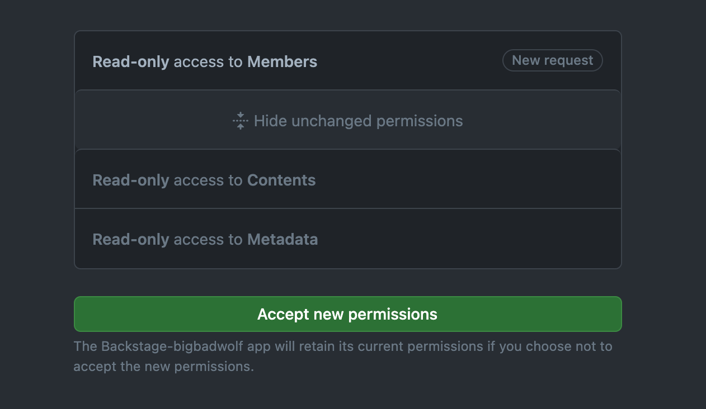

The Backstage catalog can be set up to ingest organizational data - users and
teams - directly from an organization in GitHub or GitHub Enterprise. The result
is a hierarchy of
[`User`](../../features/software-catalog/descriptor-format.md#kind-user) and
[`Group`](../../features/software-catalog/descriptor-format.md#kind-group) kind
entities that mirror your org setup.

> Note: This adds `User` and `Group` entities to the catalog, but does not
> provide authentication. See the
> [GitHub auth provider](../../auth/github/provider.md) for that.

## Installation

The processor that performs the import, `GithubOrgReaderProcessor`, comes
installed with the default setup of Backstage.

If you replace the set of processors in your installation using that facility of
the catalog builder class, you can import and add it as follows.

```ts
// Typically in packages/backend/src/plugins/catalog.ts
import { GithubOrgReaderProcessor } from '@backstage/plugin-catalog-backend';

builder.replaceProcessors(
  GithubOrgReaderProcessor.fromConfig(config, { logger }),
  // ...
);
```

## Configuration

The following configuration enables an import of the teams and users under the
org `https://github.com/my-org-name` on public GitHub.

```yaml
catalog:
  locations:
    - type: github-org
      target: https://github.com/my-org-name
  processors:
    githubOrg:
      providers:
        - target: https://github.com
          apiBaseUrl: https://api.github.com
          token: ${GITHUB_TOKEN}
```

If Backstage is configured to use GitHub Apps authentication you must grant
`Read-Only` access for `Members` under `Organization` in order to ingest users
correctly. You can modify the app's permissions under the organization settings,
`https://github.com/organizations/{ORG}/settings/apps/{APP_NAME}/permissions`.


**Please note that when you change permissions, the app owner will get an email
that must be approved first before the changes are applied.**


Locations point out the specific org(s) you want to import. The `type` of these
locations must be `github-org`, and the `target` must point to the exact URL of
some organization. You can have several such location entries if you want, but
typically you will have just one.

The processor itself is configured in the other block, under
`catalog.processors.githubOrg`. There may be many providers, each targeting a
specific `target` which is supposed to be the address of the home page of GitHub
or your GitHub Enterprise installation.

The example above assumes that the backend is started with an environment
variable called `GITHUB_TOKEN` that contains a Personal Access Token. The token
needs to have at least the scopes `read:org`, `read:user`, and `user:email` in
the given `target`.

If you want to address your own GitHub Enterprise instance, replace occurrences
of `https://github.com` in the configuration above with the address of your
GitHub Enterprise home page, and the `apiBaseUrl` to where your API endpoint
lives - commonly on the form `https://<host>/api/v3`.
