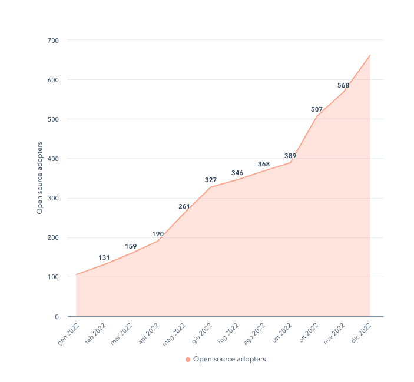
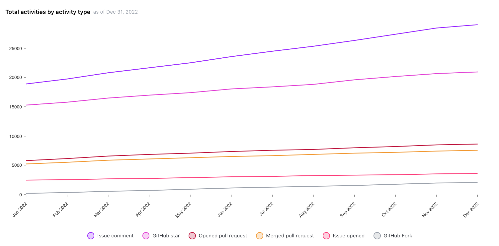
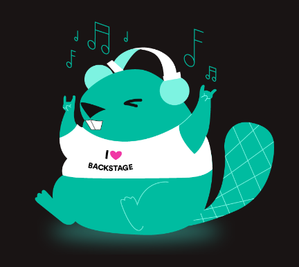

If 2021 was the year of growth for the Backstage project and community, 2022 can be easily defined as the year of maturity. Both the project and the community continued to grow at an incredible pace and the platform is now more stable, more secure, and more powerful than ever.

Our community is full of people from across the globe who bring incredible engagement and positive vibes to the project. And we finally got to experience this for the first time in real life during [BackstageCon](https://www.youtube.com/playlist?list=PLj6h78yzYM2OKySsTuiip3BqmdYZQRnSf), the very first in-person conference fully dedicated to Backstage, where hundreds of enthusiasts, the maintainers, adopters, and partners joined the event confirming the great momentum and the traction in the market.

But before anticipating too much, let’s share some stats of this amazing 2022.

<!--truncate-->

## We grew … a lot!

Last year we celebrated 75 [public adopters](https://github.com/backstage/backstage/blob/master/ADOPTERS.md) and today we have over 600 adopters, confirming the interest around Backstage across all the industries, sectors, and dimensions. Companies like [Toyota North America](https://aws.amazon.com/solutions/case-studies/toyota-ecs-case-study/), Deutsche Bank, Mercedes-Benz, Procter & Gamble, Siemens, LinkedIn, and many more joined the community this year and are actively contributing in growing the product and its maturity.

Not only are our adopters growing at an exponential rate, but so too are our contributors. Our [Discord server](https://discord.gg/backstage-687207715902193673) is a perfect example of the worlds of our adopters and contributors melding. On average, at any given hour of the day or night, there are more than 500 people online available to talk and provide support on any Backstage topic. Discord discussions run a full gamut of topics – from technical support questions to best practices for onboarding engineers to Backstage – basically, anything and everything an adopter may be interested to know and learn. At the very beginning of 2022, we “only” had 4k Discord members. Today, we have a growing membership of 8.2k.

Isn’t it what we can call a great and vibrant community of enthusiasts?

The growth of the ecosystem is not limited to the adopters and contributors. The ecosystem also includes big tech companies interested in growing Backstage by including it as part of their offering and integrations. Our [collaboration with VMWare](https://youtube.com/watch?v=GAzKCQO8Vt0&si=EnSIkaIECMiOmarE) is a great example of this, and [RedHat](https://developers.redhat.com/articles/2022/10/24/red-hat-joins-backstageio-community) joined the party this year – promising even faster growth in contributions and integrations for the Backstage project.

Before we go any further, let’s take a quick look at some more numbers, mainly coming from the [Official Github repository](https://github.com/backstage/backstage). This year…

- Our contributors grew from a group of 500 to 900+
- Contributions to the project increased from 9k to 15k+
- The number of forks shot up from 2k to 3k+
- Backstage stars increased from 14k to almost 20k
- And lastly, we welcomed over 550 adopters into our community.

All of these people driving all enormous growth and maturity for the project is represented in the chart below, which shows cumulative activities per month for Backstage:

Wow… that’s a lot of activity. We’ve generated this animation showing all of your contributions to the Backstage repository in 2022, look at this project grow:

<iframe width="780" height="440" src="https://youtu.be/GoWBvHpH5Cg" frameBorder="0" allow="accelerometer; autoplay; encrypted-media; gyroscope; picture-in-picture" allowFullScreen></iframe>

## But wait… there’s more

The growth of the community is so exciting to see. And with all this community growth, comes growth and maturity of the product, making Backstage better able to support adopters in their developer experience challenges. The Backstage open source project has almost [100 plugins](https://backstage.io/plugins), each one implementing a Backstage with a tool or service to improve not only adopters’ Backstage apps, but their unique developer experiences. And almost each week we are aware of a new one being contributed, that is amazing.

The Backstage platform itself is leaving 2022 more mature than ever, thanks to a few of these amazing milestones:

- [Backstage is now beyond version 1](https://backstage.io/blog/2022/03/17/backstage-1.0).
- [Backstage had its first Security Audit ever and now can rely on a Threat Model](https://backstage.io/blog/2022/08/23/backstage-security-audit).
- [Backstage Learn helps adopters get started more easily](https://backstage.spotify.com/learn/).
- [Backstage reached incubating status as part of the CNCF ecosystem](https://www.cncf.io/blog/2022/03/15/backstage-project-joins-the-cncf-incubator/).

And like every mature project, now Backstage has also a mascot: Bowie the Beaver!

Additionally, we launched a new [Special Interest Groups (SIGs)](https://github.com/backstage/community/tree/main/sigs) initiative this year, following the lead of Kubernetes. We believe Backstage SIGs will better coordinate contributions, grow the platform cohesively with the open source community, and allow contributors to dig even deeper as a community member. At this moment in time there two SIGs in place:

- The [Catalog SIG](https://github.com/backstage/community/blob/main/sigs/sig-catalog/README.md), covering all aspects of the systems and components related to the Software Catalog.
- The [Adoption SIG](https://github.com/backstage/community/blob/main/sigs/sig-adoption/README.md), covering all aspects of the adoption journey of Backstage.

Our plan is to open more SIGs in the 2023 to engage more with the community and to keep driving towards cohesive growth for the community and project.

Last but not least, we cannot miss the first ever conference fully dedicated to Backstage: BackstageCon. What was special there? SO much. But in particular, two things: seeing everyone in real life and the incredible mood and conversations between maintainers, adopters, partners and enthusiasts. It’s hard to emanate just how positive and amazing the vibes were in a blog, but you can read our recap [here](https://backstage.io/blog/2022/10/28/backstagecon-kubecon-2022) or watch the sessions [here](https://www.youtube.com/playlist?list=PLj6h78yzYM2OKySsTuiip3BqmdYZQRnSf). And in the meantime, here are some great numbers from the event:

- 250 attendees or a 100% full venue and packed room.
- 14 sessions
- 17 speakers

## Goodbye, 2022. Hello, 2023!

After this incredible year, thanks to everyone in the global Backstage community who contributed to the open source project in 2022. We are already working on the goals for 2023 – and as a roadmap teaser: we are very much committed to making the journey of adoption easier, faster, more valuable, and overall better. We would not be here today without our amazing community, so thank you for everything!

Looking forward to continuing collaborating together for an exciting 2023.

See you then! Happy holidays from everyone on the Backstage team at Spotify!
