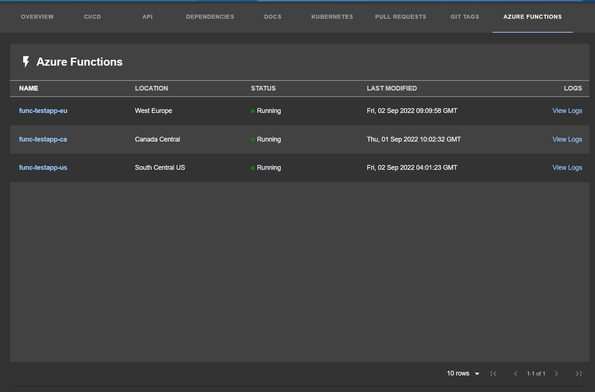

# Azure Functions Plugin



*Inspired by [roadie.io AWS Lamda plugin](https://roadie.io/backstage/plugins/aws-lambda/)*

## Features

- Azure Functions overview table

## Plugin Setup

The following sections will help you get the Azure Functions plugin setup and running

### Azure Functions Backend

You need to set up the Azure Functions backend plugin before you move forward with any of these steps if you haven't already.

### Entity Annotation

To be able to use the Azure Functions plugin you need to add the following annotation to any entities you want to use it with:

```yaml
portal.azure.com/functions-name: <function-name>
```

`<function-name>` can be an exact or partial name for the functions' app. When using a partial name, it's important that the value here matches the **start** of the functions name.

Example of Partial Matching:

Let's say you have a number of functions apps, spread out over different regions (and possibly different subscriptions), and they follow a naming convention:

```
func-testapp-eu
func-testapp-ca
func-testapp-us
```

The annotation you will use to have the three functions' app appear in the overview table would look like this:

```yaml
portal.azure.com/functions-name: func-testapp
```

### Install the component

1. Install the plugin in the `packages/app` directory

```sh
yarn add @backstage/plugin-azure-functions
```

2. Add widget component to your Backstage instance:

```ts
// In packages/app/src/components/catalog/EntityPage.tsx
import { EntityAzureFunctionsOverviewCard, isAzureFunctionsAvailable } from '@backstage/plugin-azure-functions';

...

const serviceEntityPage = (
  <EntityLayout>
    //...
    <EntityLayout.Route if={e => Boolean(isAzureFunctionsAvailable(e))} path="/azure-functions" title="Azure Functions">
      <EntityAzureFunctionsOverviewCard />
    </EntityLayout.Route>
    //...
  </EntityLayout>
);
```

## Roadmap

- [ ] Metrics